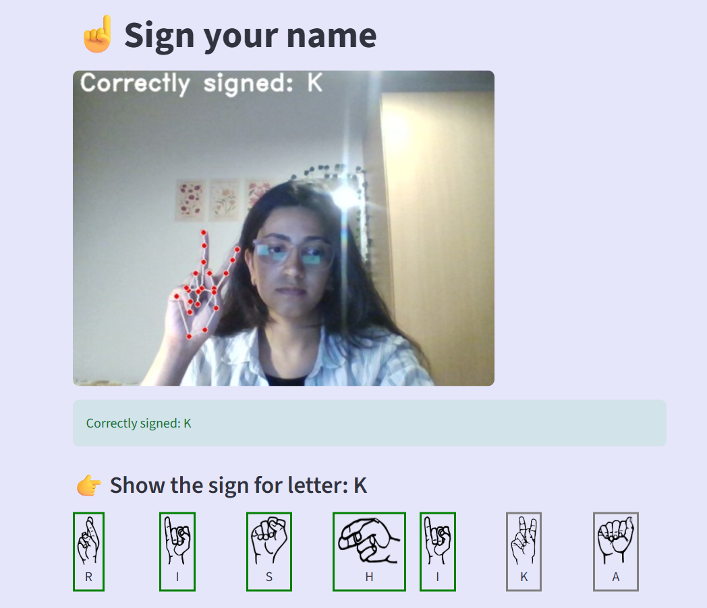

  
# ASL letter recognition with LSTM and Streamlit
This project is a real-time American Sign Language (ASL) letter recognition system built using:
1. MediaPipe for feature extraction
2. PyTorch for training a 2-later LSTM Model
3. Live webcam inference with a smooth Streamlit GUI

### Overview
This app guides users to sign each letter in their name, provides immediate feedback and smoothly transitions between letters.

## Model Architecture
Dataset: ASL Alphabet dataset containing approximately 87,000 images of alphabets. (https://www.kaggle.com/datasets/grassknoted/asl-alphabet)  
Input: 21 Hand landmark coordinates (x,y,z) extracted by MediaPipe  
Architecture: 2 layer LSTM with a fully connected output layer  
Framework: PyTorch  
Accuracy: 98.75%

## Installation
git clone https://git.rwth-aachen.de/rpanwar639/sign-language-recognition.git  
cd sign-language-recognition
pip install -r requirements.txt

## Run the app
streamlit run app.py
[▶️ Click to watch the demo](media/tutorial.mp4)